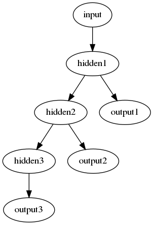

# Deep Neural Network with sparse auto encoders

Attempt at creating a DNN with a similar architecture found here:
https://arxiv.org/abs/1605.00129

Three SAEs are used to formulate the hidden layers of the DNN and then a 
logistic regression layer.

Three SAEs are trained with hidden layers being inputs to the next SAE.
 

## Sparse Autoencoder with Tensorflow
The implentationof the SAE follows the description found here: 
https://web.stanford.edu/class/cs294a/sparseAutoencoder_2011new.pdf

## Example training
```bash
python train_sae1.py --n-iters 4000 --n-hidden 1024 --export-dir sae1 --sparsity 0.15
python train_sae2.py --n-iters 4000 --n-hidden 256 --n-inputs 1024 --input-model-dir sae1 --export-dir sae2 --sparsity 0.15
python train_sae3.py --n-iters 4000 --n-hidden 64  --n-inputs 256  --input-model-dirs sae1 sae2 --export-dir sae3 --sparsity 0.1
```

# Effects of sparsity on hidden activations

```bash
for sparsity in 0.01 0.02 0.03 0.04 0.05 0.1 0.15 0.2; do
python train_sae1.py --n-iters 4000 --n-hidden 1024 --export-dir sae1_${sparsity} --sparsity ${sparsity}
python train_sae2.py --n-iters 4000 --n-hidden 256 --n-inputs 1024 --input-model-dir sae1_${sparsity} --export-dir sae2_${sparsity} --sparsity ${sparsity}
python train_sae3.py --n-iters 4000 --n-hidden 64  --n-inputs 256  --input-model-dirs sae1_${sparsity} sae2_${sparsity} --export-dir sae3_${sparsity} --sparsity ${sparsity}
done | tee output.log
```
 
 
 
 
 
 
 
 

